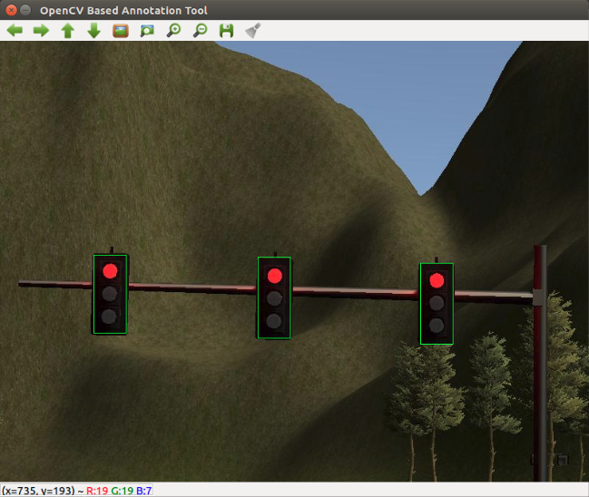

# Introduction
This write-up summarizes the approach, implementation and results of the SDC Capstone project.
We first will introduce the team members, followed by a deep dive into the implementation for each component, and finally summarizing the results and give a retrospective.

Link to [Original Udacity Readme](README_Udacity.md)

# Setup

### Basic components

* Be sure that your workstation is running Ubuntu 16.04 Xenial Xerus or Ubuntu 14.04 Trusty Tahir. [Ubuntu downloads can be found here](https://www.ubuntu.com/download/desktop).
* If using a Virtual Machine to install Ubuntu, use the following configuration as minimum:
  * 2 CPU
  * 2 GB system memory
  * 25 GB of free hard drive space

  The Udacity provided virtual machine has ROS and Dataspeed DBW already installed, so you can skip the next two steps if you are using this.

* Follow these instructions to install ROS
  * [ROS Kinetic](http://wiki.ros.org/kinetic/Installation/Ubuntu) if you have Ubuntu 16.04.
  * [ROS Indigo](http://wiki.ros.org/indigo/Installation/Ubuntu) if you have Ubuntu 14.04.
* [Dataspeed DBW](https://bitbucket.org/DataspeedInc/dbw_mkz_ros)
  * Use this option to install the SDK on a workstation that already has ROS installed: [One Line SDK Install (binary)](https://bitbucket.org/DataspeedInc/dbw_mkz_ros/src/81e63fcc335d7b64139d7482017d6a97b405e250/ROS_SETUP.md?fileviewer=file-view-default)
* Download the [Udacity Simulator](https://github.com/udacity/CarND-Capstone/releases).

### Usage

1. Clone the project repository.

2. Install python dependencies. Also, if using an NVIDIA GPU, ensure that you've installed compatible versions of python, Tensorflow, CUDA, and cuDNN. More information can be found [here](http://www.nvidia.com/object/gpu-accelerated-applications-tensorflow-installation.html):
```bash
cd CarND-Capstone
pip install -r requirements.txt
# or, if using a GPU:
pip install -r requirements-gpu.txt
```


3. Make and run styx
```bash
cd ros
catkin_make
source devel/setup.sh
roslaunch launch/styx.launch
```
4. Run the simulator

### Real world testing
1. Download [training bag](https://s3-us-west-1.amazonaws.com/udacity-selfdrivingcar/traffic_light_bag_file.zip) that was recorded on the Udacity self-driving car.
2. Unzip the file
```bash
unzip traffic_light_bag_file.zip
```
3. Play the bag file
```bash
rosbag play -l traffic_light_bag_file/traffic_light_training.bag
```
4. Launch your project in site mode
```bash
cd CarND-Capstone/ros
roslaunch launch/site.launch
```
5. Confirm that traffic light detection works on real life images

# Team Gauss
## Team Members
Name | Email | Slack
--- | --- | ---
Sascha Moecker (Team Lead)  | moeckersascha@hotmail.com | @sascha
Hiroshi Ichiki  | ichy@somof.net | @hiroshi
Saina Ramyar  | saina.ramyar@gmail.com | @saina
David Obando | david.obando@gmail.com | @davidobando
William Leu | reavenk@gmail.com | @reavenk

## Slack Channel
[Link](https://carnd.slack.com/messages/G9GQ610TH/)

# Project Documentation
## Architecture


## Waypoint Updater
The waypoint updater decides which waypoints from the static map are published to the waypoint follower and adapts its velocity according to obstacles.


### Basic Updater
The basic implementation of the waypoint updater subscribes to the `/base_waypoints` and `/current_pose` topics and publishes the next 200 waypoints, starting from the ego position to the topic `/final_waypoints`.
To do so, the waypoint updater node searches for the closest waypoint with respect to our current position. Once the index within the base waypoints array has been found, we slice the waypoints to a maximum of 200 and publish those using the final waypoints topic.
The actual content of each waypoint include the pose (position and orientation) and twist (linear and angular velocities).
The desired longitudinal speed is set to the target speed obtained from `/waypoint_loader/velocity` parameter which is eventually consumed by the waypoint follower (not part of the project tasks).

Since this approach ignores obstacles and traffic lights, an improvement has been developed which also takes stop points into account.

### Full Updater
The full updater enhances the basic updater by enabling the car to vary its speed and allowing to stop in front of traffic lights.
The major change is that the target velocity is not constant anymore but derived from the target stop point.
A target stop point can be a red traffic light as obtained from the traffic light detection node.
The information comes in a form of a global waypoint index at which the car is about to stop. A `-1` indicates no need for a stop (either no traffic light or a green one).

To come to a smooth and safe stop in front of a red traffic light, a target velocity trajectory is generated with a linear decrease of speed from the current waypoint velocity to zero. We define the notion of a "comfort braking" with an approximate deceleration of `1.5 m/s^2`.
This is the basis to calculate the distance at which a deceleration maneuver is started to gain a smooth braking.
In addition, a maximum allowed velocity is derived from the comfort braking deceleration value at which we actually achieve a full stop.
If the current velocity tops the maximum velocity, we allow for a "progressive braking" which decelerates faster until we reach the max allowed speed.

## Drive By Wire
The drive by wire node is responsible for turning desired velocities into actual commands, like braking and steering, the car can understand.
In addition, it needs to decide whether the DBW system shall get activated or not. This is communicated via the `/dbw_enabled` topic.
For safety reasons, the DBW system only published actuator commands when the system is intended to be active.

The controller task can be divided into two tasks: longitudinal and lateral control.


### Longitudinal Controller
There is a PID implementation used for the longitudinal control which maintains the speed of the vehicle.
The output is a periodically sent value via the `/throttle_cmd` topic and the `/brake_cmd` command, respectively.
The error used for the PID input is the difference between the current and the desired longitudinal speed.
The desired longitudinal speed is published by the waypoint follower in the `/twist_cmd` command topic, the current velocity via `/current_velocity`.

For both longitudinal commands, throttle and braking, the same PID is used.
Whenever the PID returns a positive value, meaning the current speed is lower than the desired one, we want to accelerate the car.
The controller output is scaled to comply the requirement of a throttle value between 0.0 and 1.0. Therefore, a soft scaling using a `tanh` is employed.

Accordingly, a negative controller output means breaking and the same post-processing step is applied, scaling the breaking value to a
feasible range between 0.0 and roughly 1000Nm; latter obtained from a calculation including the max brake torque, vehicle mass, wheel radius and deceleration limit.
To further smooth the breaking, a low pass filter is additionally applied.

For our implementation, the provided PID suffices our needs and was used without modifications.
Since the PID controller has a static I-component, a PID reset is triggered when DBW is not active.

### Lateral Controller
Likewise the PID controller, a yaw controller is used to create actual steering commands.
The output is a periodically sent value via the `/steering_cmd` topic.
Since the steering is inheritably more depended on the actual waypoints, deviations could be observed more evidently.
Problems during development were in particular the bad performance of the whole chain when running in the simulator.
Counter measurements were taken in the waypoint updater b y decoupling the reception of the position message from the updating of the final waypoints.

Internally the yaw controller uses the current velocity, angular velocity and linear velocity to compute an angle for the steering wheel.
This angle then translated to the steering command and was published.

To further smooth the control, a the same low pass filter as used for the braking value has been applied.
Also here, the provided yaw controller suffices our needs and was used straight away.

## Traffic Light detection

Traffic light detection is done whenever the vehicle approaches points known to have traffic lights. The purpose is simple: detect via optical analysis what the state of the traffic light is. If the traffic light is found to be red, this will be notified to other nodes so they can initiate a stopping maneuver. The output of this node is simply an integer number which will tell which of the base waypoints ahead of us has a stop sign in display. If no stop sign is ahead of us, then the special value `-1` is sent to the topic.

The vehicle, both in the simulator as well as Udacity's Carla, has a camera mounted in the front side of the dash so as to obtain color images that are fed to the traffic light detection node. The camera images are only processed when the car is in the vicinity of a known location of a traffic light. 

Traffic light locations are specified in configuration files to ROS, located in the [traffic light detection directory](./ros/src/tl_detector).
  - `sim_traffic_light_config.yaml` is used for the highway simulator,
  - `site_traffic_light_config.yaml` is used for Carla in the real world, and for the parking lot simulator.

Besides containing the traffic light location in the known map, the configuration files contains relevant data regarding camera configuration and file names for the weights to be used in our traffic light classification neural network.

Finally, the traffic light detection node could not operate without consuming streams from the following topics:
  - `/current_pose`: used in order to obtain the vehicle's current position in the map.
  - `/base_waypoints`: used in order to calculate the closest waypoints to the vehicle's current position. Also, the output of this node is an index number to the base waypoints.
  - `/image_color`: used in order to obtain a snapshot image from the vehicle's dash camera.

The traffic light detection node's computation will be output to the `/traffic_waypoint` topic.


Note that this node also subscribes to the `/vehicle/traffic_lights` topic, which during development time is used to obtain "ground truth" data about the state of the traffic lights. This enabled the team to continue working on downstream processes as if the classifier was functional while other team members worked on the classification problem.

The traffic light detection node is split in two main parts:
  1. Traffic light recognition: in regards to the known data (such as traffic light locations) and the vehicle's state.
  2. Traffic light classification: in regards to the image obtained from the vehicle's dash camera.

### Traffic Light Recognition
Traffic light recognition is done in [`tl_detector.py`](./ros/src/tl_detector/tl_detector.py). The first step to the traffic light recognition process is the subscription to the `/current_pose` and `/base_waypoints` topics. Whenever we get messages in these topics we simply store the value in a class varible.

By subscribing to the `/image_color` topic we ensure we get a constant flow of images from the vehicle's dash cam. This is the entry-point to our recognition process. Each time an image enters the process we calculate which is the closest traffic light to the vehicle's current location, based on our knowledge of where traffic lights should be. Once we know which light is closest to the vehicle, we verify whether the light is within visibility, simply by comparing the location of the vehicle (in waypoint index) against the location of the traffic light. If they're close enough, we initiate traffic light classification with the image.

### Traffic Light Classification
Traffic light classification is done in [`tl_classifier.py`](./ros/src/tl_detector/light_classification/tl_classifier.py). It executes on-demand based on the traffic light recognition, and returns the color state of the traffic light reflected in the camera image, expressed with a value taken from the TrafficLight class.

The traffic light classification solves two tasks.
  - Find traffic lights as bounding boxes in the camera image
  - Predict the color states of the traffic lights detected

Deep Learning is a successful technique to solve them at once. The traffic light classification applies SSD: Single Shot Multibox Detector which is one of the most powerful deep learning algorithms at the time of this writing.

To classify the color state, the traffic light classification does:

   1. Resize camera image to (300, 300) for the SSD
   2. Utilize the SSD and predict traffic lights with their color state, confidence and boundary box
   3. Get detections with the confidence is larger than 0.6
   4. Return the color state of the top of the detection list

The color state values are defined in TrafficLight class as below.

  - TrafficLight.RED
  - TrafficLight.YELLOW
  - TrafficLight.GREEN
  - TrafficLight.UNKNOWN

The SSD model is based on the following:

  - [SSD: Single Shot MultiBox Detector](https://github.com/weiliu89/caffe/tree/ssd)
  - [arXiv paper](http://arxiv.org/abs/1512.02325).

This is the summary of model as described by Keras:
```
____________________________________________________________________________________________________
Layer (type)                     Output Shape          Param #     Connected to
====================================================================================================
input_1 (InputLayer)             (None, 300, 300, 3)   0
____________________________________________________________________________________________________
conv1_1 (Conv2D)                 (None, 300, 300, 64)  1792        input_1[0][0]
____________________________________________________________________________________________________
conv1_2 (Conv2D)                 (None, 300, 300, 64)  36928       conv1_1[0][0]
____________________________________________________________________________________________________
pool1 (MaxPooling2D)             (None, 150, 150, 64)  0           conv1_2[0][0]
____________________________________________________________________________________________________
conv2_1 (Conv2D)                 (None, 150, 150, 128) 73856       pool1[0][0]
____________________________________________________________________________________________________
conv2_2 (Conv2D)                 (None, 150, 150, 128) 147584      conv2_1[0][0]
____________________________________________________________________________________________________
pool2 (MaxPooling2D)             (None, 75, 75, 128)   0           conv2_2[0][0]
____________________________________________________________________________________________________
conv3_1 (Conv2D)                 (None, 75, 75, 256)   295168      pool2[0][0]
____________________________________________________________________________________________________
conv3_2 (Conv2D)                 (None, 75, 75, 256)   590080      conv3_1[0][0]
____________________________________________________________________________________________________
conv3_3 (Conv2D)                 (None, 75, 75, 256)   590080      conv3_2[0][0]
____________________________________________________________________________________________________
pool3 (MaxPooling2D)             (None, 38, 38, 256)   0           conv3_3[0][0]
____________________________________________________________________________________________________
conv4_1 (Conv2D)                 (None, 38, 38, 512)   1180160     pool3[0][0]
____________________________________________________________________________________________________
conv4_2 (Conv2D)                 (None, 38, 38, 512)   2359808     conv4_1[0][0]
____________________________________________________________________________________________________
conv4_3 (Conv2D)                 (None, 38, 38, 512)   2359808     conv4_2[0][0]
____________________________________________________________________________________________________
pool4 (MaxPooling2D)             (None, 19, 19, 512)   0           conv4_3[0][0]
____________________________________________________________________________________________________
conv5_1 (Conv2D)                 (None, 19, 19, 512)   2359808     pool4[0][0]
____________________________________________________________________________________________________
conv5_2 (Conv2D)                 (None, 19, 19, 512)   2359808     conv5_1[0][0]
____________________________________________________________________________________________________
conv5_3 (Conv2D)                 (None, 19, 19, 512)   2359808     conv5_2[0][0]
____________________________________________________________________________________________________
pool5 (MaxPooling2D)             (None, 19, 19, 512)   0           conv5_3[0][0]
____________________________________________________________________________________________________
fc6 (Conv2D)                     (None, 19, 19, 1024)  4719616     pool5[0][0]
____________________________________________________________________________________________________
fc7 (Conv2D)                     (None, 19, 19, 1024)  1049600     fc6[0][0]
____________________________________________________________________________________________________
conv6_1 (Conv2D)                 (None, 19, 19, 256)   262400      fc7[0][0]
____________________________________________________________________________________________________
conv6_2 (Conv2D)                 (None, 10, 10, 512)   1180160     conv6_1[0][0]
____________________________________________________________________________________________________
conv7_1 (Conv2D)                 (None, 10, 10, 128)   65664       conv6_2[0][0]
____________________________________________________________________________________________________
conv7_1z (ZeroPadding2D)         (None, 12, 12, 128)   0           conv7_1[0][0]
____________________________________________________________________________________________________
conv7_2 (Conv2D)                 (None, 5, 5, 256)     295168      conv7_1z[0][0]
____________________________________________________________________________________________________
conv8_1 (Conv2D)                 (None, 5, 5, 128)     32896       conv7_2[0][0]
____________________________________________________________________________________________________
conv4_3_norm (Normalize)         (None, 38, 38, 512)   512         conv4_3[0][0]
____________________________________________________________________________________________________
conv8_2 (Conv2D)                 (None, 3, 3, 256)     295168      conv8_1[0][0]
____________________________________________________________________________________________________
pool6 (GlobalAveragePooling2D)   (None, 256)           0           conv8_2[0][0]
____________________________________________________________________________________________________
conv4_3_norm_mbox_conf_4 (Conv2D (None, 38, 38, 12)    55308       conv4_3_norm[0][0]
____________________________________________________________________________________________________
fc7_mbox_conf_4 (Conv2D)         (None, 19, 19, 24)    221208      fc7[0][0]
____________________________________________________________________________________________________
conv6_2_mbox_conf_4 (Conv2D)     (None, 10, 10, 24)    110616      conv6_2[0][0]
____________________________________________________________________________________________________
conv7_2_mbox_conf_4 (Conv2D)     (None, 5, 5, 24)      55320       conv7_2[0][0]
____________________________________________________________________________________________________
conv8_2_mbox_conf_4 (Conv2D)     (None, 3, 3, 24)      55320       conv8_2[0][0]
____________________________________________________________________________________________________
conv4_3_norm_mbox_loc (Conv2D)   (None, 38, 38, 12)    55308       conv4_3_norm[0][0]
____________________________________________________________________________________________________
fc7_mbox_loc (Conv2D)            (None, 19, 19, 24)    221208      fc7[0][0]
____________________________________________________________________________________________________
conv6_2_mbox_loc (Conv2D)        (None, 10, 10, 24)    110616      conv6_2[0][0]
____________________________________________________________________________________________________
conv7_2_mbox_loc (Conv2D)        (None, 5, 5, 24)      55320       conv7_2[0][0]
____________________________________________________________________________________________________
conv8_2_mbox_loc (Conv2D)        (None, 3, 3, 24)      55320       conv8_2[0][0]
____________________________________________________________________________________________________
conv4_3_norm_mbox_conf_flat (Fla (None, 17328)         0           conv4_3_norm_mbox_conf_4[0][0]
____________________________________________________________________________________________________
fc7_mbox_conf_flat (Flatten)     (None, 8664)          0           fc7_mbox_conf_4[0][0]
____________________________________________________________________________________________________
conv6_2_mbox_conf_flat (Flatten) (None, 2400)          0           conv6_2_mbox_conf_4[0][0]
____________________________________________________________________________________________________
conv7_2_mbox_conf_flat (Flatten) (None, 600)           0           conv7_2_mbox_conf_4[0][0]
____________________________________________________________________________________________________
conv8_2_mbox_conf_flat (Flatten) (None, 216)           0           conv8_2_mbox_conf_4[0][0]
____________________________________________________________________________________________________
pool6_mbox_conf_flat_4 (Dense)   (None, 24)            6168        pool6[0][0]
____________________________________________________________________________________________________
conv4_3_norm_mbox_loc_flat (Flat (None, 17328)         0           conv4_3_norm_mbox_loc[0][0]
____________________________________________________________________________________________________
fc7_mbox_loc_flat (Flatten)      (None, 8664)          0           fc7_mbox_loc[0][0]
____________________________________________________________________________________________________
conv6_2_mbox_loc_flat (Flatten)  (None, 2400)          0           conv6_2_mbox_loc[0][0]
____________________________________________________________________________________________________
conv7_2_mbox_loc_flat (Flatten)  (None, 600)           0           conv7_2_mbox_loc[0][0]
____________________________________________________________________________________________________
conv8_2_mbox_loc_flat (Flatten)  (None, 216)           0           conv8_2_mbox_loc[0][0]
____________________________________________________________________________________________________
pool6_mbox_loc_flat (Dense)      (None, 24)            6168        pool6[0][0]
____________________________________________________________________________________________________
mbox_conf (Concatenate)          (None, 29232)         0           conv4_3_norm_mbox_conf_flat[0][0]
                                                                   fc7_mbox_conf_flat[0][0]
                                                                   conv6_2_mbox_conf_flat[0][0]
                                                                   conv7_2_mbox_conf_flat[0][0]
                                                                   conv8_2_mbox_conf_flat[0][0]
                                                                   pool6_mbox_conf_flat_4[0][0]
____________________________________________________________________________________________________
pool6_reshaped (Reshape)         (None, 1, 1, 256)     0           pool6[0][0]
____________________________________________________________________________________________________
mbox_loc (Concatenate)           (None, 29232)         0           conv4_3_norm_mbox_loc_flat[0][0]
                                                                   fc7_mbox_loc_flat[0][0]
                                                                   conv6_2_mbox_loc_flat[0][0]
                                                                   conv7_2_mbox_loc_flat[0][0]
                                                                   conv8_2_mbox_loc_flat[0][0]
                                                                   pool6_mbox_loc_flat[0][0]
____________________________________________________________________________________________________
mbox_conf_logits (Reshape)       (None, 7308, 4)       0           mbox_conf[0][0]
____________________________________________________________________________________________________
conv4_3_norm_mbox_priorbox (Prio (None, 4332, 8)       0           conv4_3_norm[0][0]
____________________________________________________________________________________________________
fc7_mbox_priorbox (PriorBox)     (None, 2166, 8)       0           fc7[0][0]
____________________________________________________________________________________________________
conv6_2_mbox_priorbox (PriorBox) (None, 600, 8)        0           conv6_2[0][0]
____________________________________________________________________________________________________
conv7_2_mbox_priorbox (PriorBox) (None, 150, 8)        0           conv7_2[0][0]
____________________________________________________________________________________________________
conv8_2_mbox_priorbox (PriorBox) (None, 54, 8)         0           conv8_2[0][0]
____________________________________________________________________________________________________
pool6_mbox_priorbox (PriorBox)   (None, 6, 8)          0           pool6_reshaped[0][0]
____________________________________________________________________________________________________
mbox_loc_final (Reshape)         (None, 7308, 4)       0           mbox_loc[0][0]
____________________________________________________________________________________________________
mbox_conf_final (Activation)     (None, 7308, 4)       0           mbox_conf_logits[0][0]
____________________________________________________________________________________________________
mbox_priorbox (Concatenate)      (None, 7308, 8)       0           conv4_3_norm_mbox_priorbox[0][0]
                                                                   fc7_mbox_priorbox[0][0]
                                                                   conv6_2_mbox_priorbox[0][0]
                                                                   conv7_2_mbox_priorbox[0][0]
                                                                   conv8_2_mbox_priorbox[0][0]
                                                                   pool6_mbox_priorbox[0][0]
____________________________________________________________________________________________________
predictions (Concatenate)        (None, 7308, 16)      0           mbox_loc_final[0][0]
                                                                   mbox_conf_final[0][0]
                                                                   mbox_priorbox[0][0]
====================================================================================================
Total params: 23,623,752
Trainable params: 23,623,752
Non-trainable params: 0
```

### Training of the model
The model loads different weight files depending on the mode of operation: when running in the simulator we load weights that have been trained using images taken directly from the simulator in as many different poses as possible. The images were obtained by instrumenting `tl_classifier.py` and storing images with their ground truth information whenever it was unable to properly categorize it. We captured 100 images at a time, and the body of images grew to about 2078, almost evenly distributed among red, yellow and green lights. The images were then manually labeled using `opencv_annotation`.



Once the annotated images were ready, a model was trained from scratch for 100 epochs, taking 20% of the images as testing images, and 80% as training images. Given the model architecture and the size of the training data, each epoch took around 125 seconds to complete on an NVidia GTX 1080 GPU. Training on a CPU was impractical at these scales.

The code used to train the model can be found under [`tlc/training/`](./tlc/training/), follow the instructions [here](./tlc/training/README.md) for more information. This repository doesn't include the images as they accounted for over 2GB of data, but they can be downloaded from here: [capture-2.zip](https://1drv.ms/u/s!AtMG4jW974a6m8B-Q0A3tc2JbCigPw). You can place the data under the [`tlc/training/ssd/`](./tlc/training/ssd/) directory and train the model yourself.

# Results
## Videos
Description | Link
--- | ---
Driving on the test lot simulation scenario without camera and traffic light info  | [](https://www.youtube.com/watch?v=K93AdV7zbSs)
Driving on the highway simulation scenario ignoring traffic lights with temporary manual override  | [](https://www.youtube.com/watch?v=VR0Se5eRiIc)
Driving on the highway simulation scenario adhering to red traffic light (state directly taken from simulator)  | [](https://www.youtube.com/watch?v=qFJfD4xo16s)
Driving on the highway simulation scenario, full loop around the track, temporary manual override  | [](https://www.youtube.com/watch?v=TXVXI9EE7iY)

# Retrospective
## Team Collaboration
Team communication primarily was done in our Slack channel, because it allowed for persistent and delayed communication.
We set up meeting dates for summarizing our progress. Challenging was to overcome the huge time zone differences, since team members were spread around the world (America, Europe, Asia).

We used a common code base hosted on [Github](https://github.com/Moecker/sdc_capstone) with granted rights to push directly to master for all team members, avoiding delayed integration if pull requests would have be used.
For feature development, personal or collaborative branches (i.e. for the traffic light classifier) were created and later merged into the master.

The tasks break down followed the advice given in the classroom and manifested into this Write-up structure.
We could benefit from the decoupled, component oriented architecture provided by ROS and its powerful tools for faking messages by having clear interfaces between nodes. Although every team member was assigned for a particular task as the "driver", the implementation was done collaboratively.

The task break down was chosen like so:
1. Waypoint Updater Node (Partial): Complete a partial waypoint updater.
2. DBW Node: After completing this step, the car should drive in the simulator, ignoring the traffic lights.
3. Traffic Light Detection: Detect the traffic light and its color from the /image_color.
4. Waypoint publishing: Once you have correctly identified the traffic light and determined its position, you can convert it to a waypoint index and publish it.
5. Waypoint Updater (Full): Your car should now stop at red traffic lights and move when they are green.

## Improvements
* Performance of the entire chain
* Follow the waypoints more smoothly
